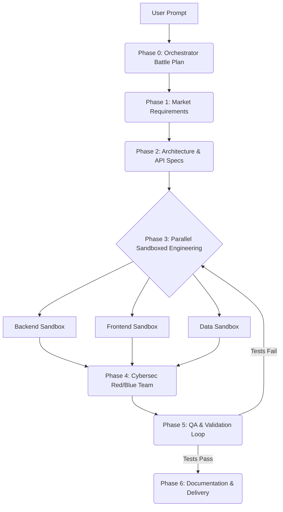

<div align="center">
  <h1>🏢 CompanyOS</h1>
  <p><strong>Enterprise Agentic Orchestration System for Google Antigravity</strong></p>
  <p>Transform a single natural-language prompt into a fully autonomous, multi-agent engineering department that builds production-grade software.</p>
</div>

---

## 🌟 What is CompanyOS?

CompanyOS is a powerful **Google Antigravity skill** based on the philosophy of *Agentic Engineering*. It moves away from naive "Loop Engineering" (one agent struggling to do everything) and introduces a true **Software Factory**.

When you provide a prompt, CompanyOS acts as the Master Orchestrator (CEO). It detects your industry, sizes the required workforce, and deploys specialized AI agents into isolated sandboxes. These agents execute a complete **Software Development Life Cycle (SDLC)**—handling market research, architecture, parallel engineering, security auditing, QA, and documentation autonomously.

---

## ✨ Key Features

- 🌍 **Industry-Agnostic Intelligence:** Adapts team behavior automatically based on your prompt. A Fintech prompt gets compliance & risk agents; an Astronomy prompt gets data pipeline & visualization agents.
- ⚖️ **Dynamic Force Sizing:** Doesn't deploy an army for a simple task. A CSS bug fix gets 1 lightweight model. A full SaaS application gets a full multi-agent battalion.
- 🤝 **Multi-Company Collaboration:** For cross-domain projects (e.g., Space Data + Quantitative Trading), CompanyOS spins up isolated "company" teams that collaborate through a Joint Program Manager via shared spec documents.
- 🔒 **Strict Directory Sandboxing:** Prevents code interference and hallucinated dependencies. Backend agents cannot touch frontend files; they communicate strictly through artifact handoffs (e.g., API contracts).
- 💻 **Cross-Platform Deterministic Validation:** Automatically detects your OS and tech stack (Node.js, Python, Rust, Go, Java). Validation gates (`validate.ps1` or `validate.sh`) ensure code is linted, type-checked, built, tested, and scanned before agents can proceed.

---

## 🤖 The Agent Roster

CompanyOS comes equipped with a specialized team. Not every agent is deployed for every task—only those necessary.

| Agent | Role & Responsibility | Sandbox Boundaries |
| :--- | :--- | :--- |
| **`@MarketResearcher`** | Analyzes the prompt, defines target audience, core features, and success metrics. | `docs/` (write only) |
| **`@ArchitectDB`** | Defines the tech stack, strict API contracts, and database schemas. | `docs/` (write only) |
| **`@BackendEngineer`** | Implements server-side logic based on API contracts. | `src/backend/` |
| **`@FrontendEngineer`** | Builds UI components and consumes APIs using mock data if necessary. | `src/frontend/` |
| **`@CybersecRedBlue`** | Acts as attacker and defender. Hunts vulnerabilities and patches them. | `src/` (read/patch) |
| **`@QATester`** | Writes and runs tests. Triggers deterministic validation scripts. | `tests/`, `src/` |
| **`@TechnicalWriter`** | Generates production-ready READMEs and deployment guides. | Project Root |

### 🚀 Extended Agents (Deployed when needed)
- **`@DataEngineer`**: For ETL/ELT pipelines, streaming, and ingestion.
- **`@ComplianceAuditor`**: For regulated domains (HIPAA, PCI-DSS, FedRAMP).
- **`@JointProgramManager`**: Orchestrates multi-company joint ventures.

---

## 🔄 The SDLC Workflow

Agents never speak directly to one another—they communicate via strict artifact handoffs, mirroring real enterprise environments.



---

## 🛠️ Installation & Auto-Activation

1. **Copy into Antigravity:** 
   Clone or copy the contents of this repository into your Antigravity skills directory:
   ```bash
   ~/.gemini/config/skills/company-os/
   ```
2. **Setup Auto-Activation (Optional but recommended):**
   Add the following rule to your global Antigravity rules file at `~/.gemini/GEMINI.md`:
   
   ```markdown
   # CompanyOS — Auto-Activation Rule

   When the user gives a prompt that describes building a product, system, platform, application, tool, or service from scratch — or says "company-os", "deploy the team", "build this like a company", "enterprise factory", or "software factory" — **automatically activate the `company-os` skill** and follow its full orchestration protocol.
   
   For simple tasks (bug fixes, small changes), do NOT activate CompanyOS. Use normal workflow.
   ```

---

## 🎯 Usage Examples

Simply give Antigravity a prompt. CompanyOS handles the rest.

**Example 1: Full Tech SaaS**
> *"Build a real-time collaborative code editor with syntax highlighting, live cursors, and GitHub integration."*
*Result:* Full 7-agent SDLC pipeline is triggered.

**Example 2: Regulated Fintech Platform**
> *"Build a cryptocurrency portfolio tracker with real-time price feeds and bank-grade security."*
*Result:* Full team + `@ComplianceAuditor` deployed. Enforces PCI-DSS, encryption-at-rest, and decimal arithmetic rules.

**Example 3: Cross-Domain Multi-Company**
> *"Build a platform that ingests telescope data from observatories and runs quantitative trading strategies based on astronomical event correlations."*
*Result:* Two isolated company teams are spun up (Astronomy + Fintech) alongside a `@JointProgramManager` to handle cross-company API boundaries.

---
<div align="center">
  <i>Built for Google Antigravity. Enterprise power at the speed of thought.</i>
</div>
